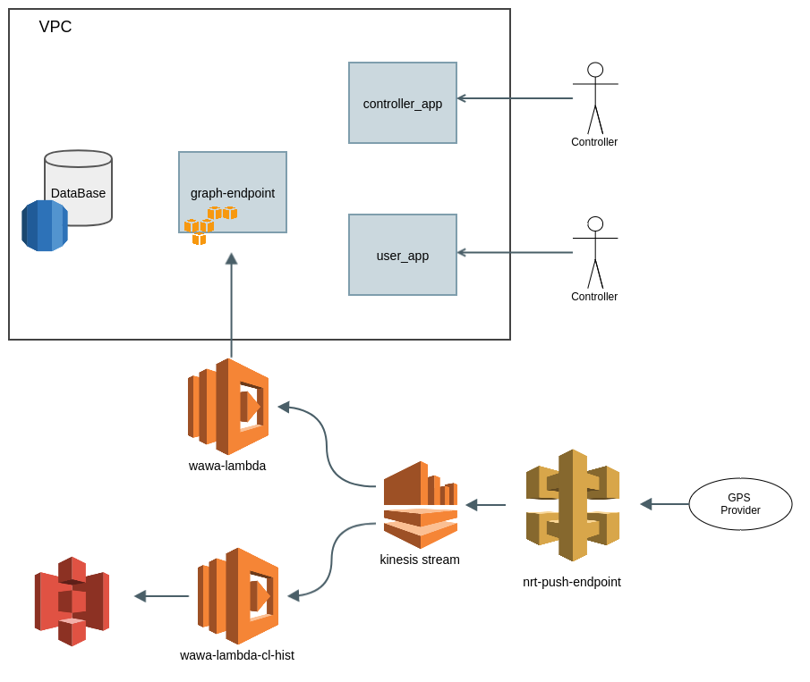

## Wawa project architecture

Wawa's components make use of some AWS services to be able to focus on the app's logic instead of cross cutting concerns of a [NRT](https://en.wikipedia.org/wiki/Real-time_computing) system.
Those services are:

- ApiGateway
- Kinesis Streams
- Lambda
- RDS
- S3
- EC2

### Components

- controller_app: mobile application used by the transport controllers on site. They can check details about buses like location, and recommendations about how often should they be dispatched on route.
- user_app: mobile application used by the users of the transport system. They can check details about buses like location, expected arrival times, available seats, etc.
- graph-endpoint: GraphQL endpoint for all backend services.
- nrt-push-endpoint: REST endpoint to receive the push events of buses location in NRT.
- wawa-lambda: lambda function to get the latest bus location and send it to the backend services for persistence.
- wawa-lambda-cl-hist: lambda function to persist in S3 all the push events for analysis on full location history.

