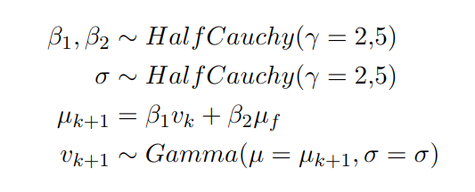

# Modelos de Machine Learning

La solución utiliza dos modelos de machine learning para generar las predicciones de tiempos de viaje y recomendaciones de despacho. Una explicación de alto nivel de estos modelos puede ser encontrada en el reporte de escalabilidad del proyecto, a continuación detallamos cada uno.

## Modelo Generativo

El modelo generativo es un modelo jerárquico bayesiano de la rapidez (magnitud de la velocidad) con la que los autobuses se mueven a lo largo de la ruta. Utiliza promedios calculados históricamente bajo ciertas combinaciones de factores para estimar una distribución de probabilidad para la rapidez en el minuto actual. Los factores considerados para calcular los promedios son: día de la semana, hora del día, tramo de la ruta (entre cada par de paradas), y presencia de lluvia.

El modelo es lineal, con una verosimilitud Gamma para la rapidez actual, función liga identidad, y distribuciones a priori Cauchy débilmente informativas para todos los parámetros, es decir:

donde $v_k$ es la rapidez a predecir, $v_{k-1}$ es la rapidez en el minuto anterior, $v_m$ es el promedio histórico bajo las condiciones en las que se quiere predecir (tramo, día de la semana, lluvia). Nótese que en este caso la verosimilitud Gamma está parametrizada en términos de su valor esperado $\mu$ y su desviación estándar $\sigma$

Para predecir los tiempos de viaje, estimamos el valor esperado de $v$ para cada combinación de factores, a través del método Monte Carlo. Cuando necesitamos predecir el tiempo de viaje de un camión a la siguiente parada, tomamos la $v$ correspondiente como su rapidez promedio para la distancia faltante entre su posición actual y la parada en cuestión. Esto se repite para todas las paradas siguientes hasta la terminal.

Este método tiene la ventaja de darnos una estimación del grado de error, que podemos calcular como la desviación estándar de una muestra tomada de la distribución posterior predictiva.

## Agente de Aprendizaje por Refuerzo

Para entrenar el agente de aprendizaje por refuerzo (_reinforcement learning_, RL) utilizamos una simulación de la ruta a partir del modelo generativo, esta simulación requiere un agente que despache los camiones siguiendo alguna política, para poder "mover" los camiones sobre la ruta. En un inicio, este agente actúa aleatoriamente, y conforme llena su _stack_ de memorias, utiliza éstas para estimar la función $Q$ (_Q-Learning_). Este entrenamiento sigue una metodología similar a la descrita en [este](https://arxiv.org/pdf/1312.5602v1.pdf) paper publicado por DeepMind, excepto por dos modificaciones.

La primera de estas modificaciones fue añadir el _stack_ de memorias, del cual el agente toma un _minibatch_ aleatorio en cada paso del entrenamiento. La segunda fue remover las capas convolucionales de la red descrita, ya que en nuestro caso la red no se alimenta de imágenes, sino de un estado diseñado manualmente para guardar la información necesaria para la estimación del valor $Q$. Este estado incluye información de la distancia entre cada terminal y el camión más cercano, así como datos acerca de la velocidad promedio en la ruta, y cuantos camiones están esperando en cada terminal. Los detalles se pueden leer en el código, incluido en este repositorio.
